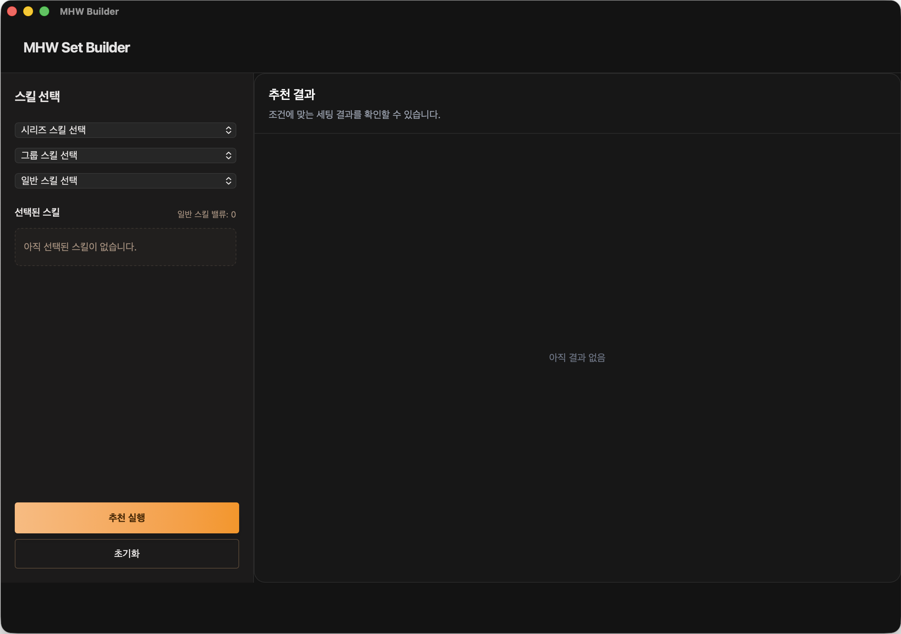
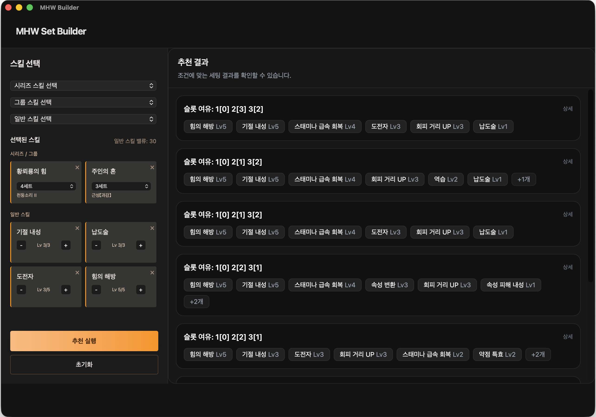
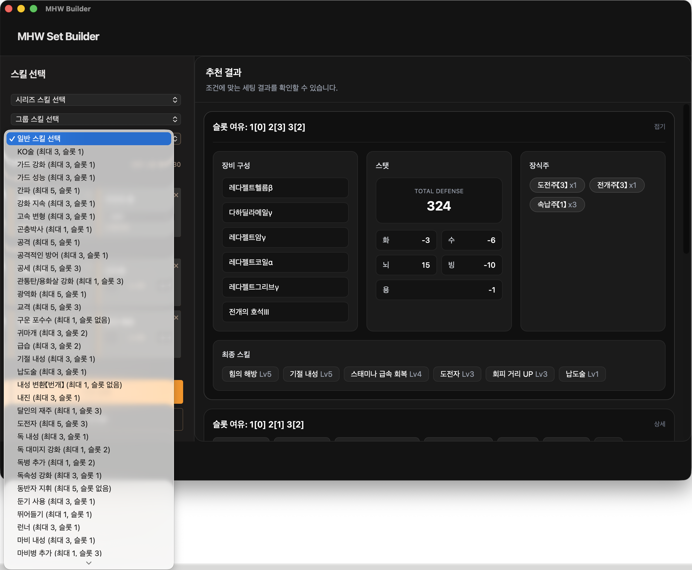

# Monster Hunter Wilds Set Builder
몬스터 헌터 와일즈 장비 세팅 추천 시스템

스킬 조건을 기반으로 실제 게임에서 구현 가능한 장비 조합을 계산하는 추천 엔진

[포트폴리오 PDF 보기](./MHWBuilder-portfolio.pdf)
---

## 1. 프로젝트 개요

사용자가 원하는 스킬 조건을 입력하면,  
세트 스킬과 장식주 슬롯 제약을 고려하여  
실제 게임에서 구현 가능한 장비 조합을 추천하는 시스템입니다.

단순한 조합 생성이 아닌,  
조건 충족 여부를 검증하는 추천 로직 구현에 초점을 맞췄습니다.

---

## 2. 개발 배경

몬스터 헌터 시리즈에서는 원하는 스킬 조합을 맞추기 위해  
수많은 장비 조합과 장식주 배치를 직접 계산해야 합니다.

특히 다음과 같은 제약이 존재합니다:

- 세트 스킬 조건 (n개 장착 시 발동)
- 장식주 슬롯 크기 제약
- 스킬 레벨 합산 계산
- 장비 부위 중복 불가

이 프로젝트는 이러한 조건을 자동으로 계산하여  
실제로 구현 가능한 세팅만 추천하는 것을 목표로 개발되었습니다.

초기에는 대규모 시스템으로 설계했으나,  
추천 로직 중심의 MVP 형태로 방향을 재설정했습니다.

---

## 3. 기술 스택

- Backend: Spring Boot  
- Language: Java 21  
- ORM: Spring Data JPA  
- DB: H2 (MVP 기준)  
- Crawling: Jsoup  
- JSON Parsing: Jackson  

---

## 4. 핵심 기능

- 스킬 기반 장비 세팅 추천
- 일반 스킬 + 세트(그룹/시리즈) 스킬 동시 선택
- 세트 스킬 조건 충족 조합 탐색
- 장식주 슬롯 기반 장착 가능 여부 검증
- 장식주 자동 배치 및 결과 계산
- 방어력 및 속성 저항 계산
- 슬롯 여유 기준 추천 결과 정렬

---

## 5. 구조 설계 특징

- 데이터 정규화를 통한 1:N 중심 구조 설계 (M:N 최소화)
- KSUID 기반 ID 생성
- DB 교체 가능 구조 설계 (MySQL → H2 전환)
- 크롤링 → DB 적재 → 추천 로직까지 전체 흐름 직접 구현

---

## 6. 핵심 설계 포인트

### 6.1 세트 스킬 우선 필터링

세트 스킬은 조합 수를 크게 증가시키는 요소이기 때문에,  
초기 단계에서 조건을 만족하는 장비 조합만 생성하도록 설계했습니다.

탐색 공간을 줄이기 위한 구조입니다.

---

### 6.2 생성과 검증의 분리

추천 로직을 다음 단계로 분리했습니다:

1. 세트 스킬 만족 조합 생성  
2. 부족 부위 채우기  
3. 장식주로 충족 가능 여부 검증  

생성과 검증을 분리하여 로직을 단순화했습니다.

---

### 6.3 장식주 슬롯 검증 알고리즘

장식주는 하위 슬롯 → 상위 슬롯 장착 가능하다는 규칙을 기반으로  
다음 조건으로 검증합니다:

- need3 ≤ slot3  
- need2 + need3 ≤ slot2 + slot3  
- need1 + need2 + need3 ≤ total slots  

게임 내 규칙을 그대로 반영한 검증 방식입니다.

---

### 6.4 추천 기준

조건을 만족하는 조합 중  
슬롯 여유가 더 많은 세팅을 우선적으로 정렬합니다.

---

### 6.5 DTO 기반 응답 설계

엔티티를 직접 노출하지 않고 DTO를 통해 응답을 구성했습니다.  
프론트엔드와의 분리와 유지보수를 고려한 구조입니다.

---

## 7. 추천 로직 흐름

1. 사용자 입력  
   - 일반 스킬 (skillId + targetLevel)  
   - 세트 스킬 (setSkillId + requiredCount)  

2. 세트 스킬 조건을 만족하는 장비 조합 생성  

3. 남은 장비 부위 채우기  

4. 현재 스킬 레벨 계산  

5. 장식주로 충족 가능 여부 검증  

6. 가능한 조합만 필터링  

7. 슬롯 여유 기준 정렬  

8. 최종 결과 반환  

---

## 8. 실행 화면

### 초기 화면

### 추천 결과

### 상세 보기

---

## 9. 프로젝트 구조

### Backend
 [백엔드 README](./mhwbuilder-backend/README.md)

### Frontend
 [프론트 README](./mhwbuilder-frontend/README.md)
